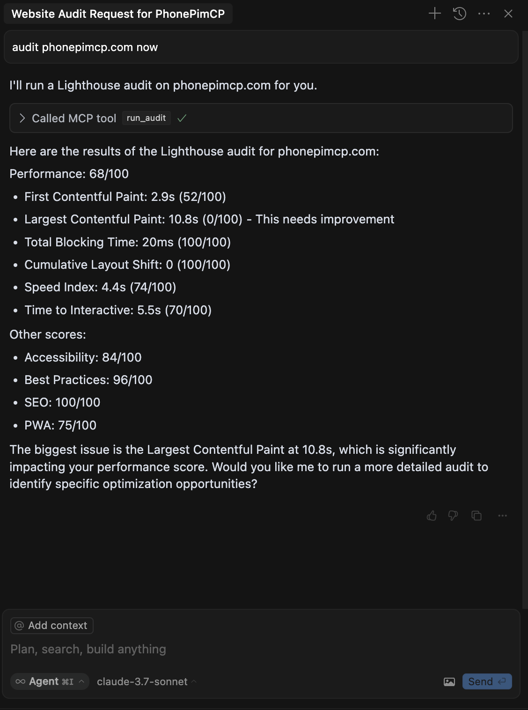

[](https://mseep.ai/app/priyankark-lighthouse-mcp)

# Lighthouse MCP Server

An MCP server that wraps around Google's Lighthouse tool to help measure various performance metrics for web pages.



## Features

- Run comprehensive Lighthouse audits on any URL
- Get performance scores and metrics
- Configure device emulation (mobile/desktop)
- Control network throttling
- Select specific audit categories

## Installation

### Option 1: Using npx (Recommended)

You can run the tool directly using npx without installation:

```bash
npx lighthouse-mcp
```

### Option 2: Global Installation

Install the package globally:

```bash
npm install -g lighthouse-mcp
```

Then run it:

```bash
lighthouse-mcp
```

### Option 3: Local Development

1. Clone this repository
2. Install dependencies:
   ```bash
   npm install
   ```
3. Build the project:
   ```bash
   npm run build
   ```
4. Run the server:
   ```bash
   npm start
   ```

## MCP Configuration

### When installed via npm (global or npx)

Add the following to your MCP settings configuration file:

```json
{
  "mcpServers": {
    "lighthouse": {
      "command": "npx",
      "args": ["lighthouse-mcp"],
      "disabled": false,
      "autoApprove": []
    }
  }
}
```

### When using local development version

Add the following to your MCP settings configuration file:

```json
{
  "mcpServers": {
    "lighthouse": {
      "command": "node",
      "args": ["/absolute/path/to/lighthouse-mcp/build/index.js"],
      "disabled": false,
      "autoApprove": []
    }
  }
}
```

Replace `/absolute/path/to/lighthouse-mcp` with the actual path to this project.

## Available Tools

### run_audit

Run a comprehensive Lighthouse audit on a URL.

**Parameters:**
- `url` (required): The URL to audit
- `categories` (optional): Array of categories to audit (defaults to all)
  - Options: "performance", "accessibility", "best-practices", "seo", "pwa"
- `device` (optional): Device to emulate (defaults to "mobile")
  - Options: "mobile", "desktop"
- `throttling` (optional): Whether to apply network throttling (defaults to true)

**Example:**
```json
{
  "url": "https://example.com",
  "categories": ["performance", "accessibility"],
  "device": "desktop",
  "throttling": false
}
```

### get_performance_score

Get just the performance score for a URL.

**Parameters:**
- `url` (required): The URL to audit
- `device` (optional): Device to emulate (defaults to "mobile")
  - Options: "mobile", "desktop"

**Example:**
```json
{
  "url": "https://example.com",
  "device": "mobile"
}
```

## Example Usage

Once the MCP server is configured, you can use it with Claude:

```
What's the performance score for example.com?
```

Claude will use the `get_performance_score` tool to analyze the website and return the results.

## Requirements

- Node.js 16+
- Chrome/Chromium browser (for Lighthouse)

## Endorsements
<a href="https://glama.ai/mcp/servers/@priyankark/lighthouse-mcp">
  
</a>
